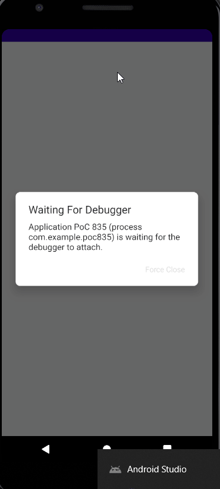

# PoC 835

PoC for whether we can display a popup from Flutter over a native screen. Relates to ticket 
[WGO-835](https://woolworthsdigital.atlassian.net/browse/WGO-835).

## Running locally

* JDK11 is required to build / run the native host part of the application
* A version of Flutter that satisfies `environment: sdk: ">=2.15.0 <3.0.0"` in the `pubspec.yaml` is required to build
  / run the Flutter part of the application

## Results

As can be seen in the GIF below, or when running this PoC locally, we are able to view a popup handled by a Flutter
module over a screen handled by native code.

## Drawbacks

The main drawback of the technique demonstrated in this PoC is that, as can be seen in the GIF above, the user can
still interact with the native host application outside the Flutter popup content. This could then allow the user to
navigate to a different activity which, when the fragment is again loaded, the popup's timer is loaded afresh and is
displayed over the other activity. Each activity that wants to participate in being a potential container for the
fragment also needs to have a `androidx.fragment.app.FragmentContainerView` in its layout, even though the layout may
never need to know about the Flutter popup.

## Recommendation

Due to the above-described drawbacks, it's recommended merely to use Flutter to send a signal (using a Platform
Channel) to the native host app, which - as long as it has a flexible API for the Flutter module to call - can be used
as a thin layer for actually drawing the dialog.
