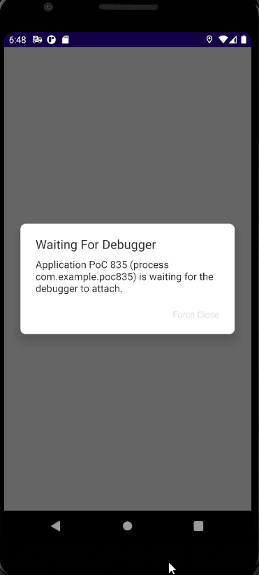

# PoC 835

PoC for whether we can display a popup from Flutter over a native screen. Relates to ticket 
[WGO-835](https://woolworthsdigital.atlassian.net/browse/WGO-835).

## Running locally

* JDK11 is required to build / run the native host part of the application
* A version of Flutter that satisfies `environment: sdk: ">=2.15.0 <3.0.0"` in the `pubspec.yaml` is required to build
  / run the Flutter part of the application

## Results

As can be seen in the GIF below, or when running this PoC locally, we are able to view a popup handled by a Flutter
module over a screen handled by native code.

